# ИДЗ 3. 

**Хрушков Степан Игоревич БПИ227** 

**Вариант 6**  

Условие: Базу данных, представленную массивом целых положительных чисел, разделяют два типа процессов: N читателей и K писателей.   
Читатели периодически просматривают случайные записи базы данных и выводя номер свой номер (например, PID), индекс записи, ее значение, а также вычисленное значение факториала.  
Писатели изменяют случайные записи на случайное число и также выводят информацию о своем номере, индексе записи, старом значении и новом значении.   
Предполагается, что в начале БД находится в непротиворечивом состоянии (все числа отсортированы).   
Каждая отдельная новая запись переводит БД из одного непротиворечивого состояния в другое (то есть, новая сортировка может поменять индексы записей или переставить числа).  
Транзакции выполняются в режиме «грязного чтения». То есть, процесс–писатель не может получить доступ к БД только в том случае, если ее уже занял другой процесс-писатель, а процессы-читатели ему не мешают обратиться к БД.  
Поэтому он может изменять базу данных, когда в ней находятся читатели.  
Создать многопроцессное приложение с потоками-писателями и потоками-читателями.  
Каждый читатель и писатель моделируется отдельным процессом.

**4-5 баллов**
***Сервер***
Читатели и писатели создают TCP-сокеты и подключаются к серверу.

Читатели генерируют случайный индекс и отправляют запрос на чтение серверу. Затем сервер получает данный запрос и извлекает значение по указанному индексу из массива и отправляет его читателю. Читатель получает значение и вычисляет факториал для числа и выводит в соответствии с заданием.

Писатели отправляют запрос на чтение текущего значения по сгенерированному индексу. Получают значение и отправляют на сервер запрос на запись нового значения. Сервер получает запрос, обновляет значение по указанному индексу в базе данных и отправляет подтверждение об обновлении.

**Скрины работы программы**
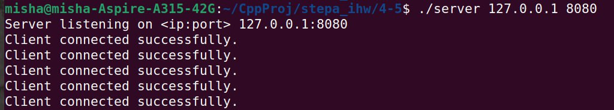
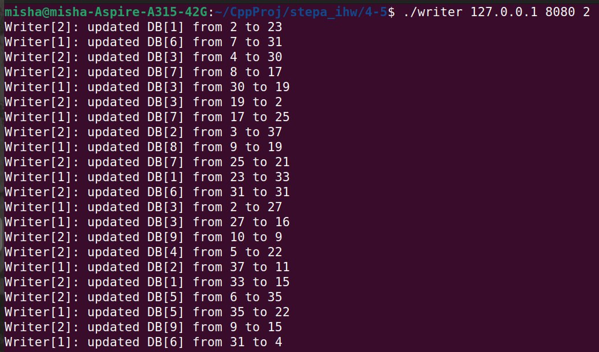
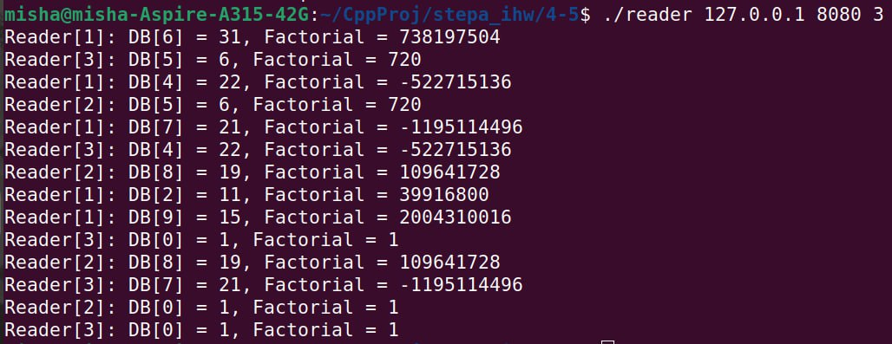

**6-7 баллов**
Аналогично программе на оценку 4-5 происходит взаимодействие читателей и писателей с сервером, но добавлено подключение мониторинга работы сервера.

Наблюдатель подключается непосредственно к серверу, который регистрирует наблюдателя получением сообщения "OBSERVER" от наблюдателя.

То есть, когда сервер обрабатывает запросы, он также формирует сообщения для наблюдателя и отправляет их ему.

**Скрины работы программы**
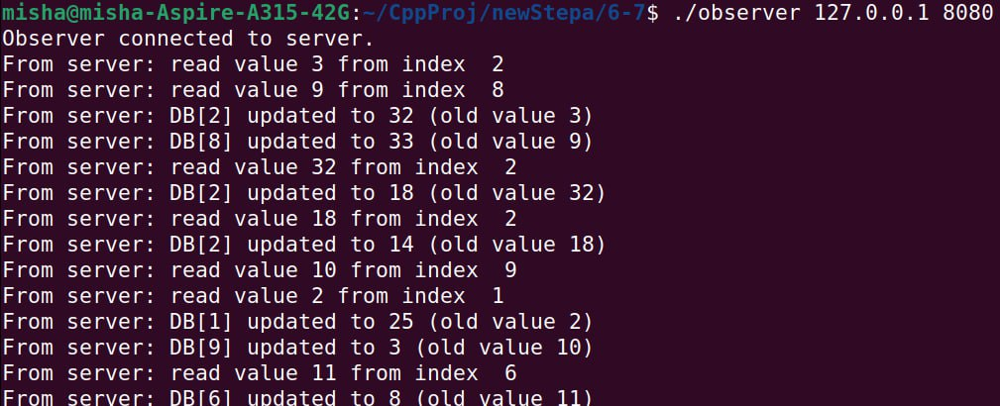
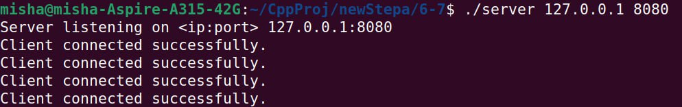
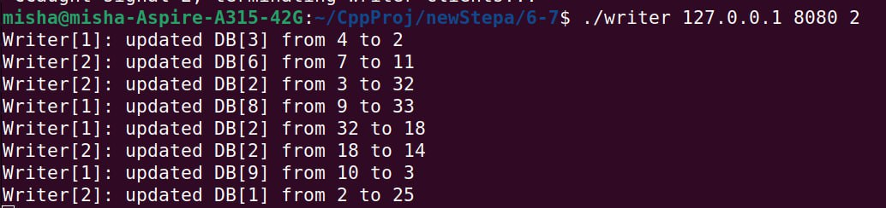

**8 баллов**
Теперь сервер хранит ключи подключенных наблюдателей в массиве, и когда наблюдатель подключается, то также отправляет сообщение "OBSERVER", и сервер добавляет его в массив. Также сервер проверяет активность от наблюдателей и удаляет отключившихся, чтобы освободить место для новых. То есть теперь наблюдатели могут свободно подключаться и отключаться в любое время, что делает наблюдение за работой программы непрерывным с нескольких компьютеров.

**Скрины работы программы**
1 вариант (просто работает):
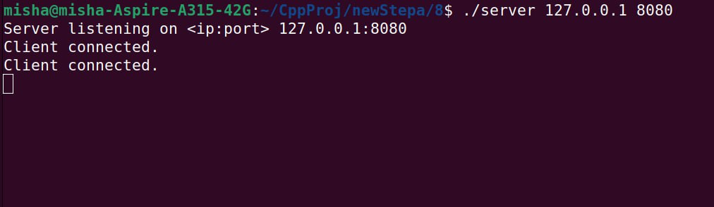
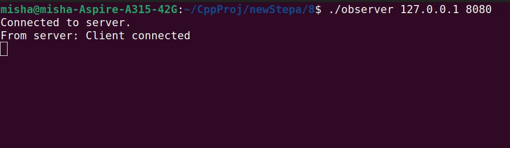
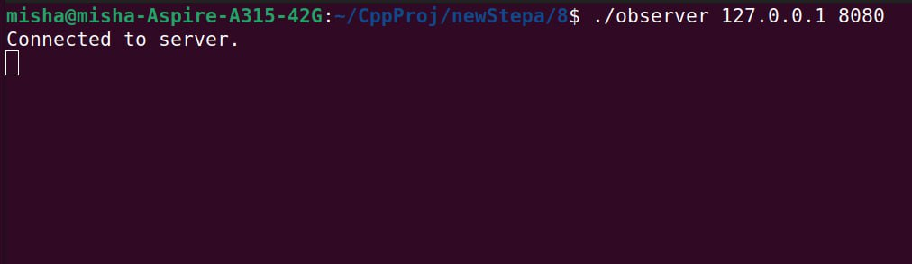

2 вариант (запуск писателей и читателей):
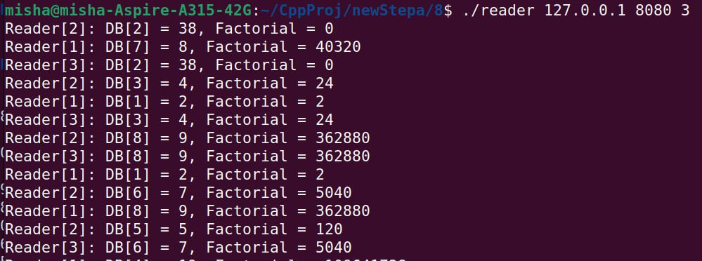
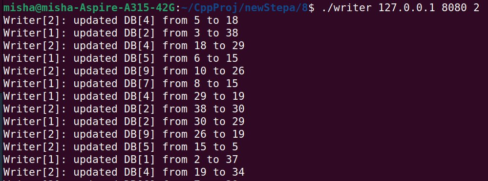
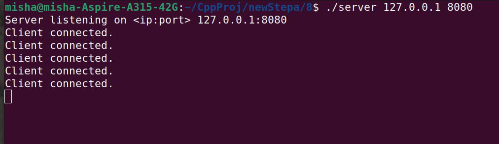

3 вариант (записи наблюдателей):
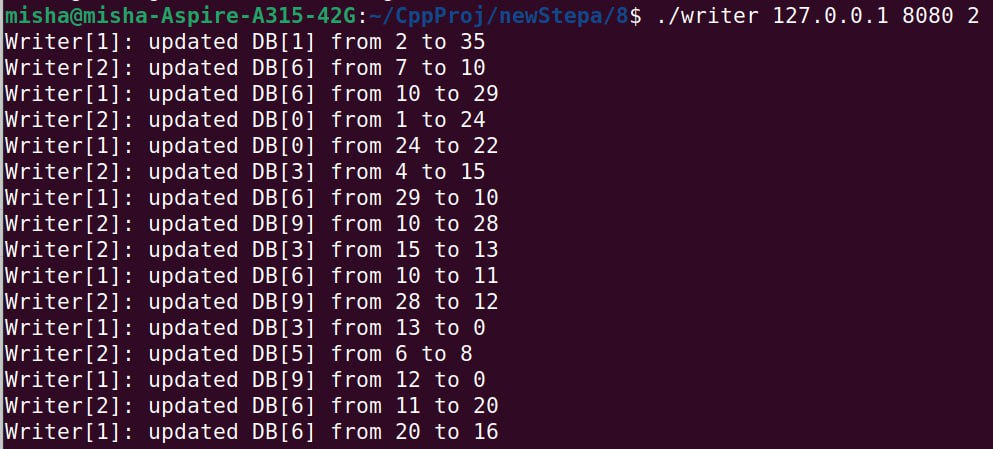
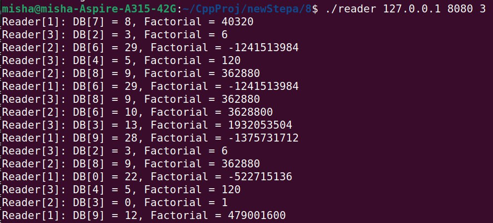
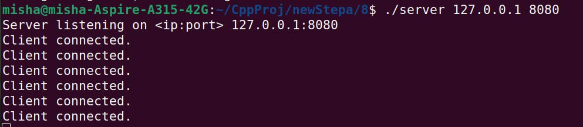
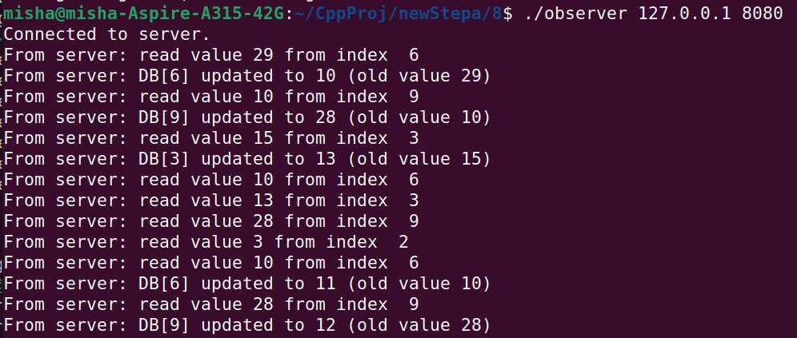